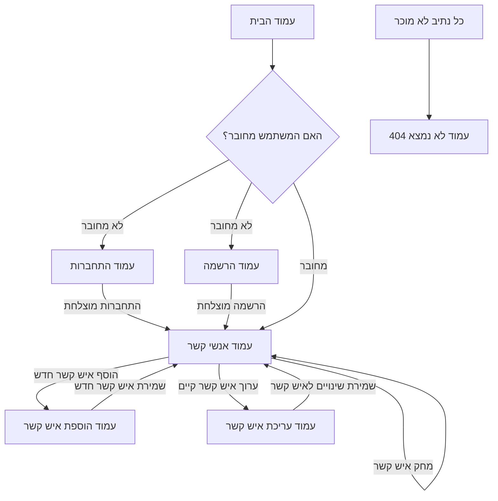

# ספר טלפונים דיגיטלי

## מדריך לכתיבת תיק פרויקט לפיתוח Web

## 1. אפיון ותכנון הפרויקט

### 1.1 שם ותיאור הפרויקט
<div dir="rtl" align="right">

* **שם הפרויקט**: ספר טלפונים דיגיטלי  
* **תיאור כללי**: "ספר טלפונים דיגיטלי" הוא יישום ווב המאפשר למשתמשים לנהל באופן אישי את אנשי הקשר שלהם. המערכת מספקת פונקציונליות מלאה של יצירה, עריכה, הצגה ומחיקה של אנשי קשר, וכן ניהול משתמשים עם הרשמה והתחברות מאובטחת. הפרויקט שואף להחליף את הצורך בספרי טלפונים פיזיים או רשימות לא מאורגנות, ומספק ממשק אינטואיטיבי לחיפוש וניהול מהיר של מידע.
* **בעיה שהפרויקט פותר**: נמאס לכם לדפדף בספר טלפונים עבה ומיושן? הפרויקט נותן מענה לצורך בכלי יעיל, מאובטח ונגיש לניהול אנשי קשר בעולם הדיגיטלי. הוא מאפשר שמירה מסודרת, גישה קלה ומהירה לפרטי קשר מכל מקום, ומונע אובדן מידע.
* **קהל יעד**: המערכת מיועדת לכל אדם או עסק הזקוק לכלי פשוט ויעיל לארגון ושמירת אנשי קשר בצורה דיגיטלית, כולל משתמשים פרטיים, עובדים, או סטודנטים המעוניינים בניהול קל של רשת הקשרים שלהם.

</div>
<div dir="rtl" align="right">

### 1.2 דרישות מערכת

<ol style="direction: rtl; text-align: right;">
    <li>
        <b>דרישות פונקציונליות (מה המשתמש יכול לעשות?)</b>:
        <ul style="direction: rtl; text-align: right;">
            <li>המשתמש יכול להירשם (Signup) למערכת עם שם מלא, אימייל וסיסמה.</li>
            <li>המשתמש יכול להתחבר (Login) למערכת באמצעות אימייל וסיסמה.</li>
            <li>המשתמש המחובר יכול להוסיף איש קשר חדש הכולל: שם מלא, מספר טלפון וכתובת.</li>
            <li>המשתמש המחובר יכול לצפות ברשימת כל אנשי הקשר שלו, המוצגת בצורת טבלה.</li>
            <li>המשתמש המחובר יכול לערוך פרטים של איש קשר קיים.</li>
            <li>המשתמש המחובר יכול למחוק איש קשר ספציפי.</li>
            <li>המערכת מציגה הודעות שגיאה למשתמש במקרה של קלט לא תקין, שגיאות אימות, או בעיות אחרות בתקשורת עם השרת.</li>
            <li>המערכת מבצעת ולידציה (אימות נתונים) בצד הלקוח (לדוגמה, בדיקת פורמט אימייל ואורך סיסמה).</li>
            <li>המערכת מבצעת אימות סיסמאות בעת הרשמה והתחברות (כולל השוואת סיסמאות).</li>
        </ul>
    </li>
    <li>
        <b>דרישות טכניות (באילו טכנולוגיות משתמשים?)</b>:
        <ul style="direction: rtl; text-align: right;">
            <li><b>Frontend</b>: HTML5, CSS3, JavaScript (Vanilla JS), Custom Elements.</li>
            <li><b>Backend</b>: Node.js עם פריים-וורק Express.js.</li>
            <li><b>Database</b>: MySQL, עם Sequelize ORM לניהול אינטראקציות עם מסד הנתונים.</li>
            <li><b>אבטחה</b>: JSON Web Tokens (JWT) לאימות משתמשים, bcrypt להצפנת סיסמאות.</li>
            <li><b>ניהול חבילות</b>: npm.</li>
            <li><b>פיתוח</b>: Nodemon לסביבת פיתוח מהירה.</li>
        </ul>
    </li>
</ol>

</div>

## 2. תכנון מבנה האפליקציה

### 2.1 מבנה תיקיית הפרויקט

```
phone-book-app/
├── client/
│   ├── CustomElements/
│   │   └── nav/
│   │       ├── nav.html
│   │       └── nav.css
│   │   └── nav.js
│   ├── css/
│   │   ├── 404.css
│   │   ├── contacts.css
│   │   ├── editContact.css
│   │   ├── index.css
│   │   ├── login.css
│   │   ├── newContact.css
│   │   └── signup.css
│   ├── imgs/
│   │   └── PictureForInspiration.jpg
│   ├── js/
│   │   ├── contacts.js
│   │   ├── editContact.js
│   │   ├── index.js
│   │   ├── login.js
│   │   ├── newContact.js
│   │   └── signup.js
│   └── pages/
│       ├── 404.html
│       ├── contacts.html
│       ├── editContact.html
│       ├── index.html
│       ├── login.html
│       ├── newContact.html
│       └── signup.html
├── server/
│   ├── src/
│   │   ├── config/
│   │   │   └── database.js
│   │   ├── controllers/
│   │   │   ├── contactController.js
│   │   │   └── userController.js
│   │   ├── middleware/
│   │   │   └── authMiddleware.js
│   │   ├── models/
│   │   │   ├── Contact.js
│   │   │   ├── User.js
│   │   │   └── index.js
│   │   └── routes/
│   │       ├── contactRoutes.js
│   │       └── userRoutes.js
│   ├── package.json
│   └── server.js
├── MySqlSetUp.sql
└── README.md
```

<<<<<<< HEAD
**הסבר על כל תיקייה**:
* `client/` - מכיל את כל קבצי צד הלקוח (Frontend) של היישום.
    * `CustomElements/` - רכיבי ווב מותאמים אישית הניתנים לשימוש חוזר, כגון סרגל הניווט.
    * `css/` - קבצי סגנון CSS ייעודיים לכל דף.
    * `imgs/` - תמונות המשמשות ביישום, כולל תמונת ההשראה לעמוד הבית.
    * `js/` - קבצי JavaScript המטפלים בלוגיקת צד הלקוח, כמו ולידציה ואינטראקציה עם השרת.
    * `pages/` - קבצי HTML המהווים את מבנה הדפים השונים של היישום.
* `server/` - מכיל את כל קבצי צד השרת (Backend) של היישום.
    * `src/` - קבצי קוד המקור העיקריים של השרת.
        * `config/` - קבצי תצורה, כולל הגדרות חיבור למסד הנתונים.
        * `controllers/` - מכיל את הלוגיקה העסקית והטיפול בבקשות HTTP עבור משתמשים ואנשי קשר (MVC Controller).
        * `middleware/` - פונקציות Middleware לטיפול בבקשות, כמו אימות משתמשים באמצעות JWT.
        * `models/` - הגדרות מודלים של מסד הנתונים באמצעות Sequelize ORM (MVC Model).
        * `routes/` - הגדרת נתיבי API לטיפול בבקשות HTTP (MVC Router).
    * `package.json` - קובץ הגדרות פרויקט ה-Node.js, המפרט את התלויות והסקריפטים להפעלה.
    * `server.js` - נקודת הכניסה העיקרית של יישום השרת, המגדירה את השרת, הנתיבים הראשיים וחיבורי ה-API.
* `MySqlSetUp.sql` - קובץ סקריפט SQL המשמש להגדרת מסד הנתונים והטבלאות ב-MySQL.
* `README.md` - קובץ זה, המכיל תיעוד מקיף של הפרויקט.
=======
<div dir="rtl" align="right">

<ul style="direction: rtl; text-align: right; list-style-position: inside;">
    <li><b>client/</b> – מכיל את כל קבצי צד הלקוח (Frontend) של היישום.
        <ul style="direction: rtl; text-align: right; list-style-position: inside;">
            <li><b>CustomElements/</b> – רכיבי ווב מותאמים אישית הניתנים לשימוש חוזר, כגון סרגל הניווט.</li>
            <li><b>css/</b> – קבצי סגנון CSS ייעודיים לכל דף.</li>
            <li><b>imgs/</b> – תמונות המשמשות ביישום, כולל תמונת ההשראה לעמוד הבית.</li>
            <li><b>js/</b> – קבצי JavaScript המטפלים בלוגיקת צד הלקוח, כמו ולידציה ואינטראקציה עם השרת.</li>
            <li><b>pages/</b> – קבצי HTML המהווים את מבנה הדפים השונים של היישום.</li>
        </ul>
    </li>
    <li><b>server/</b> – מכיל את כל קבצי צד השרת (Backend) של היישום.
        <ul style="direction: rtl; text-align: right; list-style-position: inside;">
            <li><b>src/</b> – קבצי קוד המקור העיקריים של השרת.
                <ul style="direction: rtl; text-align: right; list-style-position: inside;">
                    <li><b>config/</b> – קבצי תצורה, כולל הגדרות חיבור למסד הנתונים.</li>
                    <li><b>controllers/</b> – מכיל את הלוגיקה העסקית והטיפול בבקשות HTTP עבור משתמשים ואנשי קשר (MVC Controller).</li>
                    <li><b>middleware/</b> – פונקציות Middleware לטיפול בבקשות, כמו אימות משתמשים באמצעות JWT.</li>
                    <li><b>models/</b> – הגדרות מודלים של מסד הנתונים באמצעות Sequelize ORM (MVC Model).</li>
                    <li><b>routes/</b> – הגדרת נתיבי API לטיפול בבקשות HTTP (MVC Router).</li>
                </ul>
            </li>
            <li><b>package.json</b> – קובץ הגדרות פרויקט ה-Node.js, המפרט את התלויות והסקריפטים להפעלה.</li>
            <li><b>server.js</b> – נקודת הכניסה העיקרית של יישום השרת, המגדירה את השרת, הנתיבים הראשיים וחיבורי ה-API.</li>
        </ul>
    </li>
    <li><b>MySqlSetUp.sql</b> – קובץ סקריפט SQL המשמש להגדרת מסד הנתונים והטבלאות ב-MySQL.</li>
    <li><b>README.md</b> – קובץ זה, המכיל תיעוד מקיף של הפרויקט.</li>
</ul>

</div>
>>>>>>> a6ebead16cdd1bf9cc2c447cf9e663c45003b215

</div>

### 2.2 תרשים ניווט בין מסכים
<div dir="rtl" align="right">

۱. **מסכים עיקריים**:  
&nbsp;&nbsp;&nbsp;&nbsp;• **עמוד הבית (`index.html`)**: דף נחיתה ומידע כללי על ספר הטלפונים.  
&nbsp;&nbsp;&nbsp;&nbsp;• **עמוד הרשמה (`signup.html`)**: טופס להרשמת משתמשים חדשים.  
&nbsp;&nbsp;&nbsp;&nbsp;• **עמוד התחברות (`login.html`)**: טופס להתחברות משתמשים קיימים.  
&nbsp;&nbsp;&nbsp;&nbsp;• **עמוד אנשי קשר (`contacts.html`)**: מציג את רשימת אנשי הקשר של המשתמש המחובר.  
&nbsp;&nbsp;&nbsp;&nbsp;• **עמוד הוספת איש קשר (`newContact.html`)**: טופס להוספת איש קשר חדש לרשימה.  
&nbsp;&nbsp;&nbsp;&nbsp;• **עמוד עריכת איש קשר (`editContact.html`)**: טופס לעריכת פרטים של איש קשר קיים (נגיש דרך עמוד אנשי הקשר).  
&nbsp;&nbsp;&nbsp;&nbsp;• **עמוד שגיאה 404 (`404.html`)**: מוצג כאשר המשתמש מנסה לגשת לדף שאינו קיים.  

۲. **תרשים זרימה של הניווט**:

</div>

<div dir="rtl" align="right">


</div>

## 3. פיתוח צד הלקוח (Frontend)

<div dir="rtl" align="right">

צד הלקוח של היישום בנוי ב-HTML עבור המבנה, CSS עבור העיצוב, ו-JavaScript (Vanilla JS) עבור הלוגיקה האינטראקטיבית וקריאות ה-API.

### 3.1 דפי HTML

<<<<<<< HEAD
**דפים עיקריים**:
* `index.html` – עמוד הבית.
* `login.html` – טופס התחברות.
* `signup.html` – טופס הרשמה.
* `contacts.html` – תצוגת רשימת אנשי הקשר.
* `newContact.html` – טופס להוספת איש קשר.
* `editContact.html` – טופס לעריכת איש קשר.
* `404.html` – עמוד שגיאה.
=======
<div dir="rtl" align="right">

**דפים עיקריים**:
<ul style="direction: rtl; text-align: right; list-style-position: inside;">
    <li><code>index.html</code> – עמוד הבית.</li>
    <li><code>login.html</code> – טופס התחברות.</li>
    <li><code>signup.html</code> – טופס הרשמה.</li>
    <li><code>contacts.html</code> – תצוגת רשימת אנשי הקשר.</li>
    <li><code>newContact.html</code> – טופס להוספת איש קשר.</li>
    <li><code>editContact.html</code> – טופס לעריכת איש קשר.</li>
    <li><code>404.html</code> – עמוד שגיאה.</li>
</ul>

</div>
>>>>>>> a6ebead16cdd1bf9cc2c447cf9e663c45003b215

**קטע קוד לדוגמה - דף התחברות (`login.html`)**:
</div>

```html
<!DOCTYPE html>
<html lang="he" dir="rtl">
<head>
    <meta charset="UTF-8">
    <meta name="viewport" content="width=device-width, initial-scale=1.0">
    <link rel="stylesheet" href="../css/login.css">
    <title>ספר טלפונים</title>
</head>
<body>
    <custom-nav></custom-nav>
    <script src="../CustomElements/nav/nav.js" defer></script>
    <div class="main_container" style="direction: rtl; text-align: right;">
        <form>
            <h2>התחברות</h2>
            <div class="input_container">
                <label for="email">אימייל :</label>
                <input type="email" name="email" id="email">
            </div>
            <div class="input_container">
                <label for="password">סיסמה :</label>
                <input type="password" name="password" id="password">
            </div>
            <div class="input_container">
                <input type="submit" class="submit" value="התחבר">
            </div>
            <div class="err" id="err">
            </div>
        </form>
    </div>
    <script src="../js/login.js"> </script>
</body>
</html>
```
<div dir="rtl" align="right">

הסבר מפורט על רכיבים בדף login.html:

<ul style="direction: rtl; text-align: right; list-style-position: inside;">
    <li><code>&lt;custom-nav&gt;&lt;/custom-nav&gt;</code> - רכיב ווב (Custom Element) המשמש כסרגל ניווט עליון בכל דפי האתר. הוא מאפשר יצירת רכיבים עצמאיים ושימוש חוזר בקוד.</li>
    <li><code>&lt;div class="main_container"&gt;</code> - עוטף את תוכן הטופס ומספק בסיס לעיצוב מרכזי.</li>
    <li><code>&lt;form&gt;</code> - אלמנט טופס HTML המאגד את שדות הקלט. הוא אינו מציין <code>action</code> או <code>method</code> שכן שליחת הנתונים מטופלת באופן אסינכרוני באמצעות JavaScript (Fetch API).</li>
    <li><code>&lt;h2&gt;התחברות&lt;/h2&gt;</code> - כותרת הדף.</li>
    <li><code>&lt;div class="input_container"&gt;</code> - קונטיינר לכל שדה קלט ותוויתו, לצורך עיצוב וסידור.</li>
    <li><code>&lt;label for="email"&gt;</code> - תווית טקסט המשויכת לשדה הקלט "אימייל" באמצעות ה-<code>for</code> וה-<code>id</code>, לשיפור הנגישות.</li>
    <li><code>&lt;input type="email" id="email" name="email"&gt;</code> - שדה קלט המיועד לכתובת אימייל. ה-<code>id</code> מאפשר גישה לשדה באמצעות JavaScript.</li>
    <li><code>&lt;input type="password" id="password" name="password"&gt;</code> - שדה קלט המיועד לסיסמה, המסתיר את התווים שהוזנו.</li>
    <li><code>&lt;input type="submit" class="submit" value="התחבר"&gt;</code> - כפתור שליחה שבעת לחיצה עליו מפעיל את לוגיקת ה-JavaScript לטיפול בטופס.</li>
    <li><code>&lt;div class="err" id="err"&gt;&lt;/div&gt;</code> - אזור ריק המשמש להצגת הודעות שגיאה למשתמש על ידי JavaScript.</li>
    <li><code>&lt;script src="../js/login.js"&gt;&lt;/script&gt;</code> - קישור לקובץ JavaScript המכיל את כל הלוגיקה של דף ההתחברות.</li>
</ul>

</div>

### 3.2 קוד JavaScript (Frontend)

קובצי ה-JavaScript בצד הלקוח מטפלים באינטראקציות של המשתמש, ולידציית קלט, ושליחת בקשות ל-API של השרת.

**קטע קוד לדוגמה - לוגיקת התחברות (login.js)**:

```javascript
const email = document.getElementById('email');
const password = document.getElementById('password');
const err = document.getElementById('err');

// פונקציות ולידציה בסיסיות בעת יציאה משדה הקלט (onblur)
email.onblur = () => {
    const emailValue = email.value.trim();
    let errors = [];
    err.textContent = ""; // ניקוי שגיאות קודמות
    if (emailValue === "") {
        errors.push("לא הכנסת אימייל");
        email.classList.remove('valid', 'invalid');
    } else if (!/^[^\s@]+@[^\s@]+\.[^\s@]+$/.test(emailValue)) {
        errors.push("האימייל שהוכנס אינו תקין");
        email.classList.add('invalid');
        email.classList.remove('valid');
    } else {
        email.classList.remove('invalid');
        email.classList.add('valid');
    }
    err.textContent = errors.join("\n"); // הצגת השגיאות
};

password.onblur = () => {
    const passwordValue = password.value;
    let errors = [];
    err.textContent = "";
    if (passwordValue.length < 8) {
        errors.push("הסיסמה חייבת להיות לפחות 8 תווים");
        password.classList.add('invalid');
        password.classList.remove('valid');
    } else {
        password.classList.remove('invalid');
        password.classList.add('valid');
    }
    err.textContent = errors.join("\n");
};

// מטפל בשליחת הטופס
document.querySelector("form").addEventListener("submit", async function(event) {
    event.preventDefault(); // מונע את טעינת הדף מחדש

    const emailValue = document.getElementById("email").value;
    const passwordValue = document.getElementById("password").value;
    const errorDiv = document.getElementById("err");

    try {
        // שליחת בקשת POST ל-API של השרת
        const response = await fetch('/api/users/login', {
            method: "POST",
            headers: { "Content-Type": "application/json" },
            body: JSON.stringify({ email: emailValue, password: passwordValue })
        });

        const data = await response.json(); // ניתוח תגובת השרת כ-JSON

        if (response.ok) { // אם התגובה חיובית (קוד סטטוס 2xx)
            localStorage.setItem("token", data.token);  // שמירת ה-JWT ב-localStorage
            localStorage.setItem("userId", data.userId); // שמירת מזהה המשתמש
            window.location.href = "contacts"; // ניווט לעמוד אנשי הקשר
        } else {
            errorDiv.innerText = data.error; // הצגת הודעת שגיאה מהשרת
        }
    } catch (error) {
        errorDiv.innerText = "שגיאה בהתחברות. נסה שוב.";
        console.error("Login error:", error);
    }
});
```
<div dir="rtl" align="right">

הסבר מפורט על `login.js`:

<ul style="direction: rtl; text-align: right; list-style-position: inside;">
    <li><b>ולידציית קלט בצד הלקוח</b> – הפונקציות המטפלות באירוע <code>onblur</code> עבור שדות האימייל והסיסמה מספקות למשתמש משוב מיידי בנוגע לתקינות הקלט. זה כולל אימות פורמט אימייל תקין (באמצעות <code>regex</code>) ובדיקה שאורך הסיסמה עומד בדרישת מינימום התווים.</li>
    <li><b>מניעת רענון דף</b> – השימוש ב-<code>event.preventDefault()</code> בתוך פונקציית שליחת הטופס מונע את ההתנהגות הסטנדרטית של הדפדפנים, שהיא שליחה סינכרונית ורענון מלא של הדף. פעולה זו מאפשרת שליחת נתונים אסינכרונית וחלקה לשרת.</li>
    <li><b>Fetch API</b> – ממשק ה-<code>Fetch API</code> משמש לשליחת בקשות HTTP ל-API של השרת. במקרה זה, נשלחת בקשת <code>POST</code> לכתובת <code>/api/users/login</code> יחד עם נתוני המשתמש בפורמט <code>JSON</code> בגוף הבקשה.</li>
    <li><b>טיפול בתגובת השרת</b>:
        <ul style="direction: rtl; text-align: right; list-style-position: inside;">
            <li>הקוד בודק את סטטוס התגובה שהתקבלה מהשרת באמצעות המאפיין <code>response.ok</code>.</li>
            <li>במקרה של התחברות מוצלחת, השרת מחזיר <code>token</code> מסוג JWT (JSON Web Token) ומזהה משתמש (<code>userId</code>).</li>
            <li>נתונים חשובים אלו נשמרים ב-<code>localStorage</code> של הדפדפן, מה שמאפשר שמירה על מצב ההתחברות גם במעבר בין דפים שונים.</li>
            <li>לאחר שמירת הנתונים, המשתמש מנותב אוטומטית לעמוד <code>contacts</code> (אנשי קשר).</li>
            <li>במקרה של שגיאה בהתחברות (לדוגמה, פרטי כניסה שגויים), הודעת השגיאה המתאימה (שנשלחה מהשרת) מוצגת ישירות למשתמש.</li>
        </ul>
    </li>
    <li><b>טיפול בשגיאות</b> – בלוק ה-<code>try...catch</code> עוטף את קריאת ה-<code>fetch</code> כדי ללכוד כל שגיאות רשת או שגיאות שעלולות להתרחש בטיפול בתגובת השרת. בכך הוא מאפשר להציג הודעה מתאימה וידידותית למשתמש במקרה של תקלה בלתי צפויה.</li>
</ul>

</div>


## 4. פיתוח צד השרת (Backend)

צד השרת בנוי ב-Node.js עם Express.js, ומשמש כ-API המקבל בקשות HTTP מצד הלקוח, מבצע לוגיקה עסקית, ומתקשר עם מסד הנתונים.

### 4.1 יצירת שרת (Node.js)

**קטע קוד לדוגמה - קובץ השרת הראשי (server.js)**:

```javascript
const express = require('express');
const path = require('path');
const sequelize = require('./src/config/database'); // חיבור למסד הנתונים
const userRoutes = require('./src/routes/userRoutes'); // נתיבי API למשתמשים
const contactRoutes = require('./src/routes/contactRoutes'); // נתיבי API לאנשי קשר

const port = 3000; // פורט ההאזנה של השרת
const app = express(); // יצירת מופע של אפליקציית Express

// Middleware לטיפול בבקשות JSON - מאפשר לשרת לקבל נתונים בפורמט JSON בגוף הבקשה.
app.use(express.json());

// הגשת קבצים סטטיים (HTML, CSS, JS, תמונות) מתיקיית ה-client לדפדפן.
app.use(express.static(path.join(__dirname, '../client')));

// הגדרת נתיבי API עיקריים וקישורם לראוטרים המתאימים.
app.use('/api/users', userRoutes);
app.use('/api/contacts', contactRoutes);

// הגדרת נתיבים ספציפיים להגשת דפי HTML.
app.get("/nav.html", (req, res) => {
    res.sendFile(path.join(__dirname, "../client/CustomElements/nav/nav.html"));
});
app.get("/nav.css", (req, res) => {
    res.sendFile(path.join(__dirname, "../client/CustomElements/nav/nav.css"));
});
app.get("/", (req, res) => {
    res.sendFile(path.join(__dirname, "../client/pages/index.html"));
});
app.get("/login", (req, res) => {
    res.sendFile(path.join(__dirname, "../client/pages/login.html"));
});
app.get("/signup", (req, res) => {
    res.sendFile(path.join(__dirname, "../client/pages/signup.html"));
});
app.get("/contacts", (req, res) => {
    res.sendFile(path.join(__dirname, "../client/pages/contacts.html"));
});
app.get("/add-contact", (req, res) => {
    res.sendFile(path.join(__dirname, "../client/pages/newContact.html"));
});
app.get("/edit-contact", (req, res) => {
    res.sendFile(path.join(__dirname, "../client/pages/editContact.html"));
});

// נתיב "Catch-all" לטיפול בכל בקשה שלא תאמה נתיב קודם, ומגיש את דף השגיאה 404.
app.get("*", (req, res) => {
    res.sendFile(path.join(__dirname, "../client/pages/404.html"));
})

// סנכרון מסד הנתונים עם המודלים של Sequelize (יצירת טבלאות אם אינן קיימות)
// ולאחר מכן, הפעלת השרת.
sequelize.sync()
    .then(() => console.log('Database synced'))
    .catch(err => console.error('Database sync error:', err));

app.listen(port, () =>  console.log(`Server listening at Port ${port} and url http://localhost:${port}`));
```
<div dir="rtl" align="right">

הסבר מפורט על server.js:

<ul style="direction: rtl; text-align: right; list-style-position: inside;">
    <li><b>ייבוא מודולים</b>: הקובץ מייבא את ספריות הליבה (<code>express</code>, <code>path</code>), את אובייקט החיבור למסד הנתונים (<code>sequelize</code>), ואת אובייקטי הראוטר המוגדרים בקבצים נפרדים עבור משתמשים ואנשי קשר.</li>
    <li><b>הגדרת פורט והפעלת Express</b>: מוגדר פורט 3000 עבור השרת, ומופעל מופע חדש של אפליקציית Express, המהווה את הבסיס לשרת ה-Web.</li>
    <li><b>Middleware - <code>express.json()</code></b>: זהו Middleware מובנה ב-Express המאפשר לשרת לפרסר (לנתח) גופי בקשות נכנסות בפורמט JSON. ללא Middleware זה, הנתונים הנשלחים ב-<code>req.body</code> היו מופיעים כריקים.</li>
    <li><b>הגשת קבצים סטטיים</b>: <code>app.use(express.static(...))</code> מגדיר את תיקיית <code>client</code> כתיקייה ממנה השרת יכול להגיש קבצים סטטיים ישירות לדפדפן (כמו קבצי HTML, CSS, JavaScript, תמונות וכו'). זה מאפשר לדפדפן לטעון את כל נכסי ה-Frontend של האתר.</li>
    <li><b>הגדרת נתיבי API</b>: <code>app.use('/api/users', userRoutes)</code> ו-<code>app.use('/api/contacts', contactRoutes)</code> מנתבים בקשות HTTP מתאימות (לדוגמה, כל בקשה שמתחילה ב<code>/api/users/...</code>) לקובצי ראוטר ספציפיים (<code>userRoutes.js</code>, <code>contactRoutes.js</code>). קבצים אלו מכילים את הלוגיקה העסקית לטיפול בבקשות ה-API השונות, והפרדה זו משפרת באופן ניכר את מודולריות הקוד ונוחות התחזוקה.</li>
    <li><b>הגשת דפי HTML</b>: קיימות הגדרות <code>app.get()</code> ספציפיות המנתבות בקשות לכתובות URL מסוימות (כמו <code>/login</code>, <code>/contacts</code>) לקובצי ה-HTML המתאימים הממוקמים בתיקיית <code>client/pages</code>. זה מאפשר לשרת להגיש את דפי האתר הדינמיים.</li>
    <li><b>טיפול ב-404</b>: <code>app.get("*", ...)</code> הוא נתיב "Catch-all". אם בקשה מגיעה לשרת ולא תואמת אף אחד מהנתיבים שהוגדרו קודם לכן, היא תופנה אוטומטית לדף השגיאה <code>404.html</code>, מה שמשפר את חווית המשתמש במקרה של כתובת לא קיימת.</li>
    <li><b>סנכרון מסד הנתונים והפעלת השרת</b>:
        <ul style="direction: rtl; text-align: right; list-style-position: inside;">
            <li><code>sequelize.sync()</code>: פונקציה זו של Sequelize מנסה לסנכרן את המודלים המוגדרים בקוד עם מסד הנתונים. אם הטבלאות אינן קיימות, היא תיצור אותן על בסיס הגדרות המודל. זו דרך נוחה ושימושית להגדיר את סכימת הנתונים בסביבת פיתוח.</li>
            <li><code>app.listen(port, ...)</code>: מפעיל את השרת כך שיאזין לבקשות HTTP בפורט שצוין (3000). כאשר השרת מופעל בהצלחה, הודעה מתאימה מודפסת לקונסול, המציינת שהשרת פועל ומוכן לקבל בקשות.</li>
        </ul>
    </li>
</ul>

</div>

## 5. תכנון מסד הנתונים

מסד הנתונים MySQL מאחסן את נתוני המשתמשים ואנשי הקשר. Sequelize ORM משמש כגשר בין קוד ה-Node.js למסד הנתונים, ומאפשר אינטראקציה קלה ויעילה עם הנתונים.

### 5.1 מבנה מסד נתונים

**סקריפט SQL ליצירת הטבלאות (MySqlSetUp.sql)**:

```sql
-- יצירת משתמש ייעודי עבור היישום והענקת הרשאות
CREATE USER 'shaleva217'@'localhost' IDENTIFIED BY '123456';
GRANT ALL PRIVILEGES ON addresbook.* TO 'shaleva217'@'localhost';
FLUSH PRIVILEGES;

-- מחיקת טבלת 'contacts' אם קיימת (לצרכי פיתוח/ניקוי סביבה)
DROP TABLE IF EXISTS `contacts`;

-- יצירת טבלת 'contacts' (אנשי קשר)
CREATE TABLE `contacts` (
  `idaddresses` INT NOT NULL AUTO_INCREMENT, -- מזהה ייחודי של איש הקשר (מפתח ראשי)
  `user_id` INT NOT NULL,                    -- מפתח זר המצביע למשתמש שיצר את איש הקשר
  `full_name` VARCHAR(100) DEFAULT NULL,     -- שם מלא של איש הקשר
  `phone_number` VARCHAR(20) DEFAULT NULL,   -- מספר טלפון
  `address` VARCHAR(255) DEFAULT NULL,       -- כתובת
  PRIMARY KEY (`idaddresses`),               -- הגדרת מפתח ראשי
  KEY `user_id` (`user_id`),                 -- יצירת אינדקס על מפתח זר
  CONSTRAINT `contacts_ibfk_1` FOREIGN KEY (`user_id`) REFERENCES `users` (`idusers`) ON DELETE CASCADE ON UPDATE CASCADE
) ENGINE=InnoDB AUTO_INCREMENT=10 DEFAULT CHARSET=utf8mb4 COLLATE=utf8mb4_0900_ai_ci;

-- יצירת טבלת 'users' (משתמשים)
CREATE TABLE `users` (
  `idusers` INT NOT NULL AUTO_INCREMENT,     -- מזהה ייחודי של המשתמש (מפתח ראשי)
  `name` VARCHAR(45) NOT NULL,               -- שם המשתמש
  `email` VARCHAR(45) NOT NULL,              -- כתובת אימייל (חובה וייחודית)
  `password` VARCHAR(255) DEFAULT NULL,      -- סיסמת המשתמש (מאוחסנת כמוצפנת)
  PRIMARY KEY (`idusers`),                   -- הגדרת מפתח ראשי
  UNIQUE KEY `email_UNIQUE` (`email`),       -- אילוץ ייחודיות על האימייל
  UNIQUE KEY `idusers_UNIQUE` (`idusers`)    -- אילוץ ייחודיות על מזהה המשתמש (אוטומטי)
) ENGINE=InnoDB AUTO_INCREMENT=6 DEFAULT CHARSET=utf8mb4 COLLATE=utf8mb4_0900_ai_ci;
```
<<<<<<< HEAD

הסבר מפורט על מבנה הטבלאות:

* **טבלת `users`**:
    * `idusers`: מפתח ראשי מסוג `INT` עם Auto-Increment, המשמש לזיהוי ייחודי של כל משתמש במערכת.
    * `name`: שדה `VARCHAR(45)` המיועד לאחסון שם המשתמש.
    * `email`: שדה `VARCHAR(45)` לאחסון כתובת האימייל. הוא מוגדר כ-`NOT NULL` וכ-`UNIQUE KEY`, מה שמבטיח שכל משתמש יירשם עם כתובת אימייל ייחודית אחת בלבד.
    * `password`: שדה `VARCHAR(255)` המיועד לאחסון הסיסמה המוצפנת של המשתמש. אורך של 255 תווים מתאים לאחסון גיבובי `bcrypt`, אשר ארוכים יותר מסיסמאות טקסט רגיל.

* **טבלת `contacts`**:
    * `idaddresses`: מפתח ראשי מסוג `INT` עם Auto-Increment, המשמש לזיהוי ייחודי של כל איש קשר.
    * `user_id`: מפתח זר מסוג `INT` המקשר כל איש קשר למשתמש שיצר אותו. זהו שדה `NOT NULL` כדי להבטיח שכל איש קשר ישויך למשתמש קיים במערכת.
    * `full_name`: שדה `VARCHAR(100)` לאחסון השם המלא של איש הקשר.
    * `phone_number`: שדה `VARCHAR(20)` לאחסון מספר הטלפון של איש הקשר.
    * `address`: שדה `VARCHAR(255)` לאחסון כתובת המגורים של איש הקשר.

* **קשר גומלין (FOREIGN KEY)**: טבלת `contacts` מקושרת לטבלת `users` באמצעות מפתח זר `user_id` המפנה לעמודה `idusers` בטבלת `users`.
    * `ON DELETE CASCADE`: כלל זה קובע שאם משתמש נמחק מטבלת `users`, כל אנשי הקשר המשויכים אליו בטבלת `contacts` יימחקו אוטומטית.
    * `ON UPDATE CASCADE`: כלל זה מציין שאם ה-`idusers` של משתמש משתנה (תרחיש נדיר אך אפשרי), ה-`user_id` המתאים בטבלת `contacts` יתעדכן בהתאם.
=======
<div dir="rtl" align="right">

הסבר מפורט על מבנה הטבלאות:

<ul style="direction: rtl; text-align: right; list-style-position: inside;">
    <li>
        <b>טבלת <code>users</code></b>:
        <ul style="direction: rtl; text-align: right; list-style-position: inside;">
            <li><code>idusers</code>: מפתח ראשי מסוג <code>INT</code> עם Auto-Increment, המשמש לזיהוי ייחודי של כל משתמש במערכת.</li>
            <li><code>name</code>: שדה <code>VARCHAR(45)</code> המיועד לאחסון שם המשתמש.</li>
            <li><code>email</code>: שדה <code>VARCHAR(45)</code> לאחסון כתובת האימייל. הוא מוגדר כ-<code>NOT NULL</code> וכ-<code>UNIQUE KEY</code>, מה שמבטיח שכל משתמש יירשם עם כתובת אימייל ייחודית אחת בלבד.</li>
            <li><code>password</code>: שדה <code>VARCHAR(255)</code> המיועד לאחסון הסיסמה המוצפנת של המשתמש. אורך של 255 תווים מתאים לאחסון גיבובי <code>bcrypt</code>, אשר ארוכים יותר מסיסמאות טקסט רגיל.</li>
        </ul>
    </li>
    <li>
        <b>טבלת <code>contacts</code></b>:
        <ul style="direction: rtl; text-align: right; list-style-position: inside;">
            <li><code>idaddresses</code>: מפתח ראשי מסוג <code>INT</code> עם Auto-Increment, המשמש לזיהוי ייחודי של כל איש קשר.</li>
            <li><code>user_id</code>: מפתח זר מסוג <code>INT</code> המקשר כל איש קשר למשתמש שיצר אותו. זהו שדה <code>NOT NULL</code> כדי להבטיח שכל איש קשר ישויך למשתמש קיים במערכת.</li>
            <li><code>full_name</code>: שדה <code>VARCHAR(100)</code> לאחסון השם המלא של איש הקשר.</li>
            <li><code>phone_number</code>: שדה <code>VARCHAR(20)</code> לאחסון מספר הטלפון של איש הקשר.</li>
            <li><code>address</code>: שדה <code>VARCHAR(255)</code> לאחסון כתובת המגורים של איש הקשר.</li>
        </ul>
    </li>
    <li>
        <b>קשר גומלין (<code>FOREIGN KEY</code>)</b>: טבלת <code>contacts</code> מקושרת לטבלת <code>users</code> באמצעות מפתח זר <code>user_id</code> המפנה לעמודה <code>idusers</code> בטבלת <code>users</code>.
        <ul style="direction: rtl; text-align: right; list-style-position: inside;">
            <li><code>ON DELETE CASCADE</code>: כלל זה קובע שאם משתמש נמחק מטבלת <code>users</code>, כל אנשי הקשר המשויכים אליו בטבלת <code>contacts</code> יימחקו אוטומטית.</li>
            <li><code>ON UPDATE CASCADE</code>: כלל זה מציין שאם ה-<code>idusers</code> של משתמש משתנה (תרחיש נדיר אך אפשרי), ה-<code>user_id</code> המתאים בטבלת <code>contacts</code> יתעדכן בהתאם.</li>
        </ul>
    </li>
</ul>

</div>
>>>>>>> a6ebead16cdd1bf9cc2c447cf9e663c45003b215

### 5.2 מודלים של Sequelize

מודלי Sequelize הם ייצוגים אובייקטיים של הטבלאות במסד הנתונים. הם מאפשרים אינטראקציה נוחה ויעילה עם הנתונים באמצעות שיטות JavaScript, במקום כתיבת שאילתות SQL ישירות.

**מודל User (server/src/models/User.js)**:

```javascript
const { Sequelize, DataTypes } = require('sequelize');
const sequelize = require('../config/database');

const User = sequelize.define('User', {
    idusers: {
        type: DataTypes.INTEGER,
        autoIncrement: true,
        primaryKey: true
    },
    name: {
        type: DataTypes.STRING(45),
        allowNull: true // מותר NULL, אך בקוד הרשמה זה חובה
    },
    email: {
        type: DataTypes.STRING(45),
        allowNull: true, // מותר NULL, אך בקוד הרשמה זה חובה
        unique: true
    },
    password: {
        type: DataTypes.STRING(255), // אורך 255 עבור סיסמאות מוצפנות (bcrypt)
        allowNull: true // מותר NULL, אך בפועל הסיסמה תמיד תהיה קיימת
    }
}, {
    timestamps: false, // מונע הוספת עמודות createdAt ו-updatedAt
    tableName: 'users' // מציין במפורש את שם הטבלה במסד הנתונים
});

module.exports = User;
```

**מודל Contact (server/src/models/Contact.js)**:

```javascript
const { Sequelize, DataTypes } = require('sequelize');
const sequelize = require('../config/database');
const User = require('./User'); // ייבוא מודל User לצורך הגדרת קשר גומלין

const Contact = sequelize.define('Contact', {
    idaddresses: {
        type: DataTypes.INTEGER,
        autoIncrement: true,
        primaryKey: true
    },
    user_id: {
        type: DataTypes.INTEGER,
        allowNull: false, // חובה לקשר למשתמש
        references: {
            model: User,  // מפנה למודל User
            key: 'idusers' // עמודת המפתח הראשי במודל User
        }
    },
    full_name: {
        type: DataTypes.STRING(100),
        allowNull: true
    },
    phone_number: {
        type: DataTypes.STRING(20),
        allowNull: true
    },
    address: {
        type: DataTypes.STRING(255),
        allowNull: true
    }
}, {
    timestamps: false, // מונע הוספת עמודות createdAt ו-updatedAt
    tableName: 'contacts' // מציין במפורש את שם הטבלה במסד הנתונים
});

// הגדרת קשרי גומלין בין המודלים:
// משתמש יכול שיהיו לו הרבה אנשי קשר (One-to-Many)
User.hasMany(Contact, { foreignKey: 'user_id', onDelete: 'CASCADE' });
// איש קשר שייך למשתמש אחד (Many-to-One)
Contact.belongsTo(User, { foreignKey: 'user_id' });

module.exports = Contact;
```
<<<<<<< HEAD

הסבר על מודלי Sequelize:

* `sequelize.define()`: פונקציה זו מגדירה את המודל, קובעת את שם הטבלה המתאימה במסד הנתונים (באמצעות `tableName`), ומגדירה את העמודות השונות המרכיבות את הטבלה.
* `DataTypes`: קובע את סוג הנתונים של כל עמודה (לדוגמה, `INTEGER`, `STRING`, `TEXT`), ומבטיח שהנתונים יאוחסנו בצורה הנכונה במסד הנתונים.
* `autoIncrement`, `primaryKey`, `unique`, `allowNull`: הגדרות אלו קובעות אילוצים ותכונות נוספות לעמודות, כגון האם העמודה היא מפתח ראשי, האם ערכיה צריכים להיות ייחודיים, והאם מותר להכיל ערכי NULL.
* `references` (במודל `Contact`): הגדרה זו מגדירה את המפתח הזר ומקשרת אותו למודל `User` ולמפתח הראשי שלו (`idusers`), ובכך יוצרת קשר בין הטבלאות ברמת המודל.
* `User.hasMany(Contact)` ו-`Contact.belongsTo(User)`: אלו הן הגדרות יחסים מובנות של Sequelize המגדירות את הקשר "אחד לרבים" (One-to-Many) בין משתמשים לאנשי קשר. הגדרות אלו מאפשרות לבצע פעולות כמו שליפת כל אנשי הקשר של משתמש מסוים בקלות ובאופן אינטואיטיבי.
=======
<div dir="rtl" align="right">

הסבר על מודלי Sequelize:

<ul style="direction: rtl; text-align: right; list-style-position: inside;">
    <li>
        <b><code>sequelize.define()</code></b> – פונקציה זו מגדירה את המודל, קובעת את שם הטבלה המתאימה במסד הנתונים (באמצעות <code>tableName</code>), ומגדירה את העמודות השונות המרכיבות את הטבלה.
    </li>
    <li>
        <b><code>DataTypes</code></b> – קובע את סוג הנתונים של כל עמודה (לדוגמה, <code>INTEGER</code>, <code>STRING</code>, <code>TEXT</code>), ומבטיח שהנתונים יאוחסנו בצורה הנכונה במסד הנתונים.
    </li>
    <li>
        <b><code>autoIncrement</code>, <code>primaryKey</code>, <code>unique</code>, <code>allowNull</code></b> – הגדרות אלו קובעות אילוצים ותכונות נוספות לעמודות, כגון האם העמודה היא מפתח ראשי, האם ערכיה צריכים להיות ייחודיים, והאם מותר להכיל ערכי NULL.
    </li>
    <li>
        <b><code>references</code> (במודל <code>Contact</code>)</b> – הגדרה זו מגדירה את המפתח הזר ומקשרת אותו למודל <code>User</code> ולמפתח הראשי שלו (<code>idusers</code>), ובכך יוצרת קשר בין הטבלאות ברמת המודל.
    </li>
    <li>
        <b><code>User.hasMany(Contact)</code> ו-<code>Contact.belongsTo(User)</code></b> – אלו הן הגדרות יחסים מובנות של Sequelize המגדירות את הקשר "אחד לרבים" (One-to-Many) בין משתמשים לאנשי קשר. הגדרות אלו מאפשרות לבצע פעולות כמו שליפת כל אנשי הקשר של משתמש מסוים בקלות ובאופן אינטואיטיבי.
    </li>
</ul>

</div>
>>>>>>> a6ebead16cdd1bf9cc2c447cf9e663c45003b215

## 6. בדיקות ואבטחת מידע

הפרויקט משלב מספר היבטים קריטיים של אבטחה ובדיקות כדי להבטיח את תקינות המערכת, שלמות הנתונים והגנת המידע הרגיש של המשתמשים.

### 6.1 ולידציה ובדיקות

**ולידציית קלט בצד הלקוח (Frontend Validation)**:
<<<<<<< HEAD

הטפסים בדפי הרשמה (`signup.js`) והתחברות (`login.js`) כוללים בדיקות JavaScript ראשוניות על שדות הקלט כמו `email` ו-`password` (וגם `confirmPassword` בדף ההרשמה).
* **בדיקת אימייל**: מוודא שהפורמט של כתובת האימייל תקין ושהשדה אינו ריק.
* **בדיקת סיסמה**: מוודא שאורך הסיסמה עומד בדרישת מינימום של 8 תווים.
* **אישור סיסמה**: מוודא ששדה "אישור סיסמה" תואם לערך שהוזן בשדה "סיסמה".
* **משוב למשתמש**: הודעות שגיאה רלוונטיות מוצגות למשתמש בזמן אמת, ובנוסף, מוסיפים או מסירים קלאסים (`valid`/`invalid`) לשדות הקלט כדי לספק אינדיקציה חזותית ברורה על תקינות הקלט.
=======
<div dir="rtl" align="right">

<ul style="direction: rtl; text-align: right; list-style-position: inside;">
    <li>
        הטפסים בדפי הרשמה (<code>signup.js</code>) והתחברות (<code>login.js</code>) כוללים בדיקות JavaScript ראשוניות על שדות הקלט כמו <code>email</code> ו-<code>password</code> (וגם <code>confirmPassword</code> בדף ההרשמה).
    </li>
    <li>
        <b>בדיקת אימייל</b>: מוודא שהפורמט של כתובת האימייל תקין ושהשדה אינו ריק.
    </li>
    <li>
        <b>בדיקת סיסמה</b>: מוודא שאורך הסיסמה עומד בדרישת מינימום של 8 תווים.
    </li>
    <li>
        <b>אישור סיסמה</b>: מוודא ששדה "אישור סיסמה" תואם לערך שהוזן בשדה "סיסמה".
    </li>
    <li>
        <b>משוב למשתמש</b>: הודעות שגיאה רלוונטיות מוצגות למשתמש בזמן אמת, ובנוסף, מוסיפים או מסירים קלאסים (<code>valid</code>/<code>invalid</code>) לשדות הקלט כדי לספק אינדיקציה חזותית ברורה על תקינות הקלט.
    </li>
</ul>

</div>
>>>>>>> a6ebead16cdd1bf9cc2c447cf9e663c45003b215

**דוגמה (מתוך client/js/signup.js)**:

```javascript
email.onblur = () => {
    const emailValue = email.value.trim();
    let errors = [];
    err.textContent = "";
    if (emailValue === "") {
        errors.push("לא הכנסת אימייל");
    } else if (!/^[^\s@]+@[^\s@]+\.[^\s@]+$/.test(emailValue)) {
        errors.push("האימייל שהוכנס אינו תקין");
    }
    err.textContent = errors.join("\n");
};

password.onblur = () => {
    const passwordValue = password.value;
    let errors = [];
    err.textContent = "";
    if (passwordValue.length < 8) {
        errors.push("הסיסמה חייבת להיות לפחות 8 תווים");
    }
    err.textContent = errors.join("\n");
};

confirmPassword.onblur = () => {
    const passwordValue = password.value;
    const confirmPasswordValue = confirmPassword.value;
    let errors = [];
    err.textContent = "";
    if (confirmPasswordValue !== passwordValue) {
        errors.push("הסיסמאות אינן תואמות");
    }
    err.textContent = errors.join("\n");
};
```

**ולידציית קלט בצד השרת (Backend Validation)**:

בקרת הוספת איש קשר (`server/src/controllers/contactController.js`) כוללת בדיקה שכל השדות המחוייבים (`full_name`, `phone_number`, `address`) אינם ריקים לפני הוספתם למסד הנתונים. זוהי שכבת אבטחה קריטית וחיונית, שכן ולידציית לקוח ניתנת תמיד לעקיפה על ידי משתמשים בעלי ידע טכני.

**דוגמה (מתוך server/src/controllers/contactController.js)**:

```javascript
const createContact = async (req, res) => {
    try {
        const { full_name, phone_number, address } = req.body;
        if (!full_name || !phone_number || !address) {
            return res.status(400).json({ error: "All fields are required!" });
        }
        // ... המשך יצירת איש הקשר
    } catch (error) { /* ... */ }
};
```

בקרת הרשמת משתמשים (`server/src/routes/userRoutes.js`) כוללת בדיקה חיונית האם כתובת אימייל מסוימת כבר קיימת במערכת, ומונעת יצירת חשבונות כפולים.

### 6.2 אבטחת מידע

**הצפנת סיסמאות (Bcrypt)**:

סיסמאות המשתמשים אינן נשמרות בטקסט רגיל במסד הנתונים. במקום זאת, הן מוצפנות באמצעות ספריית `bcrypt`, שהיא פונקציית גיבוב קריפטוגרפית חזקה (cryptographic hash function) המיועדת במיוחד לאבטחת סיסמאות.
תהליך ההצפנה כולל שימוש ב"מלח" (`salt`) אקראי, מה שמבטיח שגם אם שתי סיסמאות זהות יוצפנו, הגיבובים שלהן יהיו שונים לחלוטין. מספר סבבי הגיבוב (`salt rounds`) מוגדר ל-10, מה שמקשה משמעותית על התקפות Brute-Force ו-Rainbow Table.

**דוגמה (מתוך server/src/routes/userRoutes.js)**:

```javascript
// בהרשמה:
const hashedPassword = await bcrypt.hash(password, 10);
const newUser = await User.create({ name, email, password: hashedPassword });

// בהתחברות:
const validPassword = await bcrypt.compare(password, user.password);
if (!validPassword) {
    return res.status(401).json({ error: "Invalid email or password" });
}
```

**אימות מבוסס JWT (JSON Web Tokens)**:

לאחר התחברות או הרשמה מוצלחת, השרת מנפיק למשתמש אסימון JWT. אסימון זה מקודד את מזהה המשתמש ופרטים נוספים, ונחתם באמצעות מפתח סודי הידוע רק לשרת.
האסימון נשמר בצד הלקוח (`localStorage`) ונשלח עם כל בקשה עוקבת ל-API מוגן (כמו גישה או ניהול אנשי קשר).
**Middleware לאימות**: פונקציית `authenticateUser` (`server/src/middleware/authMiddleware.js`) מופעלת באופן אוטומטי לפני כל נתיב מוגן. היא מוודאת שהאסימון תקף, חתום כהלכה, ולא פג תוקפו. אם האסימון תקין, פרטי המשתמש המפוענחים מוספים לאובייקט `req.user`, מה שמאפשר לראוטרים ולבקרים לדעת מי המשתמש המחובר כעת.

**דוגמה (מתוך server/src/middleware/authMiddleware.js)**:

```javascript
const jwt = require('jsonwebtoken');

const authenticateUser = (req, res, next) => {
    const token = req.headers.authorization?.split(" ")[1]; // שליפת הטוקן מכותרת Authorization

    if (!token) {
        return res.status(401).json({ error: 'Unauthorized access. Token required.' });
    }

    try {
        const decoded = jwt.verify(token, 'your_secret_key'); // אימות הטוקן
        req.user = decoded; // הוספת נתוני המשתמש לבקשה
        next(); // המשך לבקר הבא
    } catch (error) {
        return res.status(403).json({ error: 'Invalid or expired token.' });
    }
};
module.exports = authenticateUser;
```

**הפרדת תפקידים/הרשאות (Authorization)**:

כל בקשות ה-API הנוגעות לאנשי קשר דורשות אימות משתמש.
כאשר משתמש מנסה לערוך או למחוק איש קשר, הבקר (`contactController.js`) מוודא לא רק שהמשתמש מחובר, אלא גם ש-`user_id` של איש הקשר הספציפי תואם למזהה המשתמש שהתקבל מאסימון ה-JWT. זה מבטיח שמשתמשים יכולים לנהל אך ורק את אנשי הקשר שהם עצמם יצרו, ולא של משתמשים אחרים במערכת.

**דוגמה (מתוך server/src/controllers/contactController.js - פונקציית `updateContact`)**:

```javascript
const updateContact = async (req, res) => {
    try {
        const contactId = req.params.id;
        const tokenUserId = req.user.id; // מזהה המשתמש מתוך הטוקן

        // חיפוש איש הקשר עם מזהה ספציפי וודאות שהוא שייך למשתמש המחובר
        const contact = await Contact.findOne({ where: { idaddresses: contactId, user_id: tokenUserId } });

        if (!contact) {
            return res.status(404).json({ error: "Contact not found or unauthorized to edit" });
        }
        // ... המשך עדכון איש הקשר
    } catch (error) { /* ... */ }
};
```
<<<<<<< HEAD

**הגנת מפתחות סודיים (שיפורים מומלצים)**:

* **שיפור קריטי**: נכון לעכשיו, מפתח ה-JWT הסודי ופרטי החיבור למסד הנתונים (שם משתמש, סיסמה) מקודדים ישירות בתוך הקוד (`server/src/config/database.js` ו-`server/src/routes/userRoutes.js`, `server/src/middleware/authMiddleware.js`).
* **המלצה לאבטחה משופרת**: יש להעביר מפתחות סודיים אלה למשתני סביבה (Environment Variables) ולהשתמש בספרייה כמו `dotenv` כדי לטעון אותם. זה מונע חשיפה פוטנציאלית של מידע רגיש בקוד המקור הנשלח למאגרי קוד.

**העברת JWT מ-`localStorage` לעוגיות HttpOnly (שיפורים מומלצים)**:

* **שיפור קריטי**: אחסון JWT ב-`localStorage` חושף את היישום להתקפות XSS (Cross-Site Scripting), שבהן תוקף יכול לגשת לאסימון.
* **המלצה לאבטחה משופרת**: מומלץ לשמור את ה-JWT בעוגיות `HttpOnly` (שאינן נגישות דרך JavaScript בצד הלקוח), `Secure` (נשלחות רק בחיבורי HTTPS מוצפנים) ובעלות הגדרת `SameSite=Lax` או `Strict` (להגנה מפני התקפות CSRF). השרת יטפל בהגדרת העוגיות ובדיקתן.
=======
<div dir="rtl" align="right">

**הגנת מפתחות סודיים (שיפורים מומלצים)**

<ul style="direction: rtl; text-align: right; list-style-position: inside;">
    <li><b>שיפור קריטי:</b> נכון לעכשיו, מפתח ה-JWT הסודי ופרטי החיבור למסד הנתונים (שם משתמש, סיסמה) מקודדים ישירות בתוך הקוד (<code>server/src/config/database.js</code> ו-<code>server/src/routes/userRoutes.js</code>, <code>server/src/middleware/authMiddleware.js</code>).</li>
    <li><b>המלצה לאבטחה משופרת:</b> יש להעביר מפתחות סודיים אלה למשתני סביבה (Environment Variables) ולהשתמש בספרייה כמו <code>dotenv</code> כדי לטעון אותם. זה מונע חשיפה פוטנציאלית של מידע רגיש בקוד המקור הנשלח למאגרי קוד.</li>
</ul>

**העברת JWT מ-<code>localStorage</code> לעוגיות HttpOnly (שיפורים מומלצים)**

<ul style="direction: rtl; text-align: right; list-style-position: inside;">
    <li><b>שיפור קריטי:</b> אחסון JWT ב-<code>localStorage</code> חושף את היישום להתקפות XSS (Cross-Site Scripting), שבהן תוקף יכול לגשת לאסימון.</li>
    <li><b>המלצה לאבטחה משופרת:</b> מומלץ לשמור את ה-JWT בעוגיות <code>HttpOnly</code> (שאינן נגישות דרך JavaScript בצד הלקוח), <code>Secure</code> (נשלחות רק בחיבורי HTTPS מוצפנים) ובעלות הגדרת <code>SameSite=Lax</code> או <code>Strict</code> (להגנה מפני התקפות CSRF). השרת יטפל בהגדרת העוגיות ובדיקתן.</li>
</ul>

</div>
>>>>>>> a6ebead16cdd1bf9cc2c447cf9e663c45003b215

**שימוש ב-HTTPS (שיפורים מומלצים)**:

בסביבת פרודקשן (סביבת ייצור), חובה להשתמש בפרוטוקול HTTPS (Secure HTTP) כדי להצפין את כל התקשורת בין הלקוח לשרת. הצפנה זו מונעת ציתות, יירוט ושינוי נתונים רגישים על ידי צדדים שלישיים.

## 7. סיכום

פרויקט "ספר הטלפונים הדיגיטלי" מספק פלטפורמה מלאה ופונקציונלית לניהול אנשי קשר אישיים. הוא מדגים שימוש מושכל בטכנולוגיות ווב מודרניות: Node.js ו-Express.js בצד השרת לבניית API חזק, MySQL ו-Sequelize ORM לניהול נתונים באופן יעיל, ו-HTML, CSS, ו-JavaScript בצד הלקוח לבניית ממשק משתמש אינטואיטיבי ומגיב.

הפרויקט משלב היבטי אבטחה בסיסיים וחשובים הכוללים הצפנת סיסמאות באמצעות ספריית `bcrypt` חזקה, ואימות משתמשים מאובטח באמצעות JSON Web Tokens (JWT). כמו כן, מיושמת ולידציית קלט הן בצד הלקוח והן בצד השרת כדי להבטיח את תקינות הנתונים.

ניתן להרחיב את הפרויקט בעתיד על ידי הוספת פונקציונליות מתקדמת כמו חיפוש מורכב, יכולות ייבוא וייצוא של אנשי קשר, סנכרון עם שירותי צד שלישי, ושיפורים נוספים באבטחה וביצועים (כגון שימוש בעוגיות HttpOnly למפתחות JWT ויישום חובה של HTTPS בכל הסביבות).


